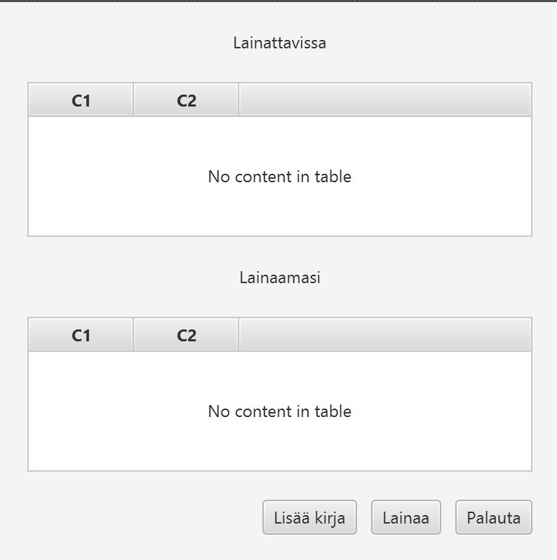
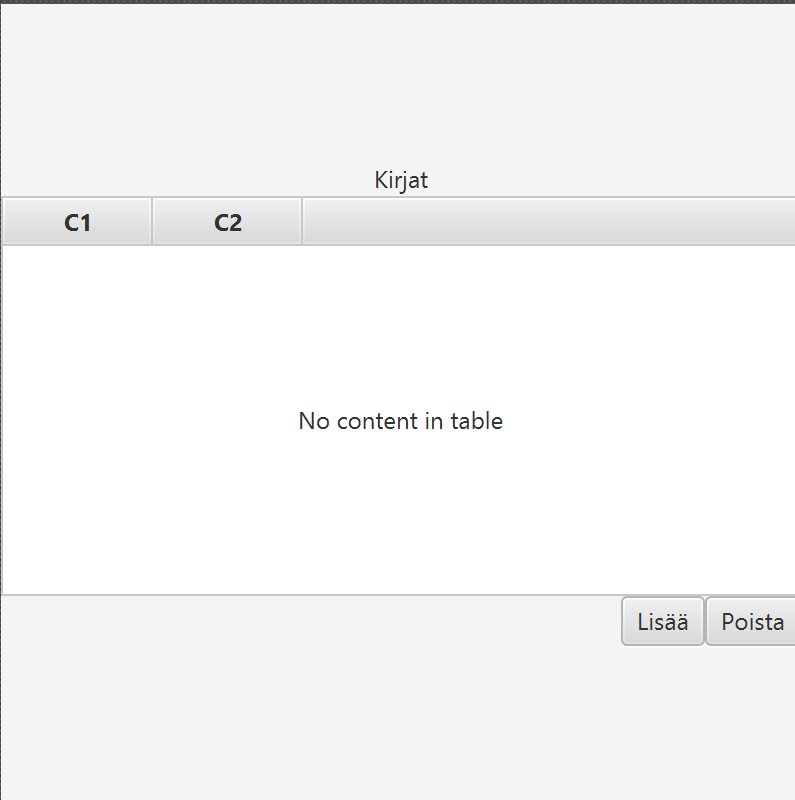

# Käyttöliittymän suunnitelma

## Päänäkymä

**Olennaiset toiminnot**

- Käyttäjä näkee lainaamansa ja lainattavissa olevat kirjat
- Käyttäjä voi lainata ja paluttaa teoksia
- Käyttäjä voi siirtyä lisäämään kirjoja toiseen näkymää

**Olennaiset komponentit**

Kirjakokoelma
- Sisältää ne kirjat, jotka näytetään loppukäyttäjälle perustuen tallennetun tiedoston sisältöön
Lainakokoelma
- Sisältää lainaukset, jotka näytetään loppukäyttäjälle tiedostosta

Kirjan ja lainauksen mallit
- Määrää mitä kirja ja lainaus voi sisältää, hoitaa myös tarkastuksia

Näkymän kontrolleri
- Esittää tarvittavat tiedot taulukoissa ja käsittelee käyttäjän toimintoja

## Kirjalista

**Olennaiset toiminnot**

- Kirjalistan tarkoituksena on sallia käyttäjällä kirjojen lisääminen tietokantaan
- Kirjalistaan ilmestyy tietokannan kirjat ja niiden kaikki tiedot
- Käyttäjä voi lisätä ja poistaa kirjoja tietokantaan

**Olennaiset komponentit**

Kirjakokoelma
- Sisältää ne kirjat, jotka näytetään loppukäyttäjälle perustuen tallennetun tiedoston sisältöön

Kirjan malli
- Määrää mitä kirja voi sisältää, hoitaa myös tarkastuksia

Näkymän kontrolleri
- Esittää tarvittavat tiedot taulukoissa ja käsittelee käyttäjän toimintoja
