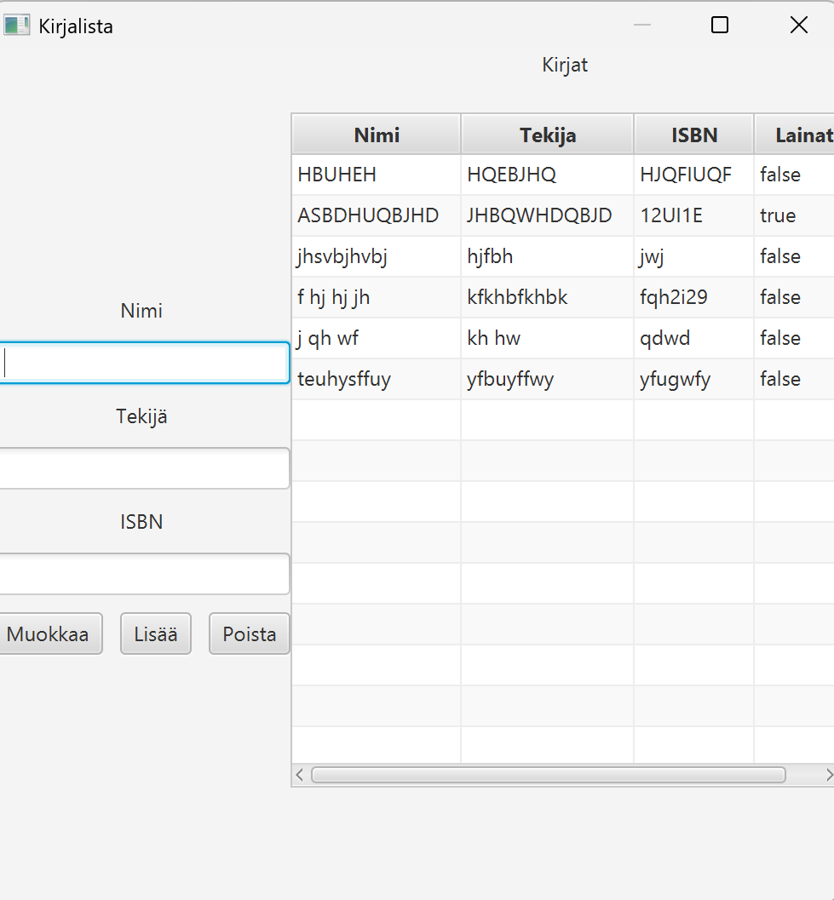
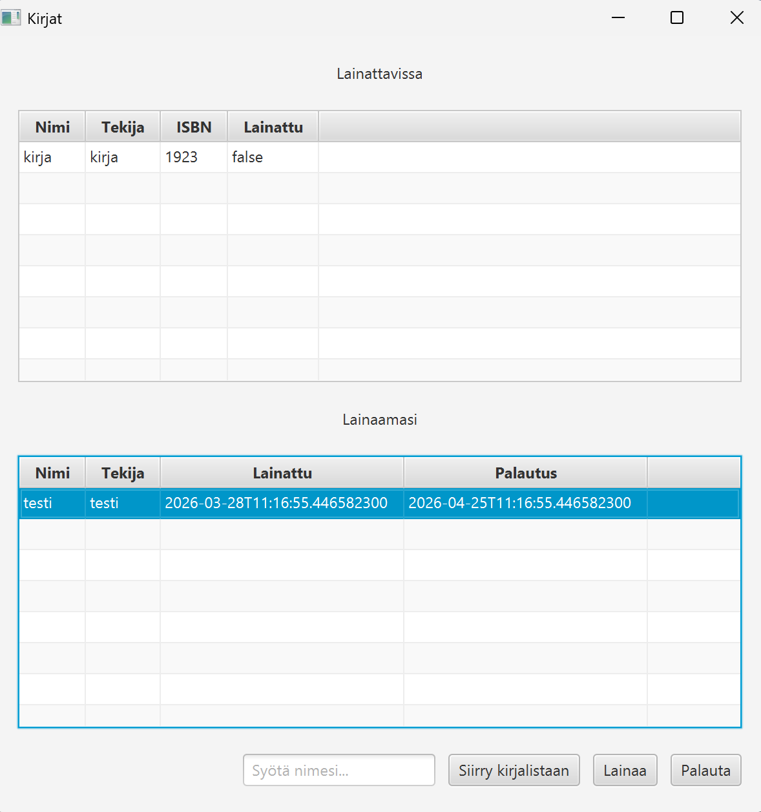
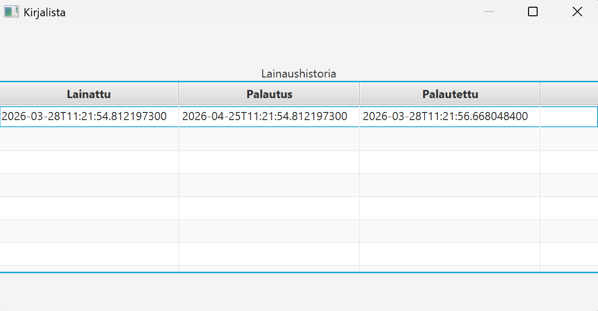

Ohjelmointi 2 -kurssin harjoitustyö

Kirjastosovellus, jonne käyttäjä voi syöttää kirjoja ja niiden tietoja. Kirjoja voidaan hakea kirjastosta
helposti, jolloin ne esitetään taulukkona käyttäjälle. Kirjoja voi myös lainata ja palauttaa kirjastonhoitajien toimestia, ja 
lainaushistoriaa on mahdollista seurata niin käyttöliittymän etusivuilta, kuin myös kirjojen muokkaussivulta.

**Kirjalista**

- Tarjoaa kirjastonhoitajalle mahdollisuuden seurata kirjojen lainauksia ja lainaushistoriaa
- On mahdollista myös muokata olemassa olevia kirjoja helposti samasta käyttöliittymästä klikkaamalla kohdetta kerran, syöttämällä tiedot ja painamalla muokkaa
- Tuplaklikkaamalla kohdetta, voit avata lainahistorian

**Kirjat**

- Tästä näkymästä voit nähdä lainattavissa olevat teokset, sekä niiden tiedot
- Käyttäjä ei voi nähdä jo lainattuja teoksia.
- Voit lainata kirja valitsemalla sen listasta, ja klikkaamalla lainaa. Tieto lainauksesta tallennetaan erilliseen lainaukset tiedostoon, sekä kirja merkitään lainatuksi
- Voit seurata palautuspäivämäärää lainauksistasi ja palauttaa ne valitsemalla teos listasta ja klikkamalla palauta

**Lainahistoria**

- Voit seurata lainahistoriasta teosten menneitä lainauksia ja niiden palautuksia